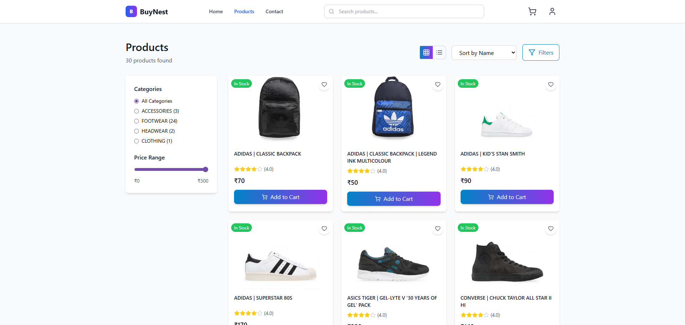

# BuyNest: Full-Stack E-commerce Application

Welcome to **BuyNest**, a modern full-stack e-commerce platform built with React on the frontend and Express.js on the backend. This project demonstrates robust cart management, dynamic order summaries, seamless email notifications, and well-structured Express APIs.



---

## 🚀 Tech Stack

### Frontend
- **React** with functional components & hooks  
- **Tailwind-CSS** for sleek, responsive UI components  
- **React Router** for client-side routing  
- State management with React Context API  
- Axios for API calls  

### Backend
- **Node.js** with **Express.js** for APIs  
- MongoDB for data persistence  
- Sendgrid for email notifications  
- Environment-based configuration with `.env` files  

---

## 🛒 Cart Handling

- Cart state managed via React Context API for global accessibility  
- Persistent cart across pages with add, update, and remove product features  
- Dynamic updates on quantity, color, and size selections  
- Real-time total amount and summary recalculations  

---

## 📋 Dynamic Order Summary

- Displays detailed product info: name, selected size & color, quantity, and price  
- Calculates subtotal, estimated taxes (e.g., 15%), and total amount dynamically  
- Responsive UI using Material-UI components for clarity and elegance  

---

## 📧 Email Notifications

- Backend triggers order confirmation emails on successful checkout  
- Configured using Sendgrid for reliable email delivery  
- Email includes order details and customer information  

---

## ⚙️ Express APIs

- Structured routes using Express Router  
- APIs for fetching products, creating orders, and checkout processing  
- Controllers separate business logic from routing  
- Environment variables secure sensitive data (DB credentials, email credentials)  

---

## 🔐 Environment Variables

### Frontend (.env)
```
VITE_API_URL=<backend_api_url>
```

### Backend (.env)
```
PORT=<port_number>
MONGODB_URI=<mongodb_connection_string>
JWT_SECRET=<jwt_secret_key>
SENDGRID_API_KEY=<sendgrid_api_key>
CLOUDINARY_CLOUD_NAME=<cloudinary_cloud_name>
CLOUDINARY_API_KEY=<cloudinary_api_key>
CLOUDINARY_API_SECRET=<cloudinary_api_secret>
```

Make sure to create `.env` files in both frontend and backend directories with the above variables filled in with your values.

---

## 🛠 Running the Project

### Backend
```bash
cd backend
npm install
npm start
```

---


