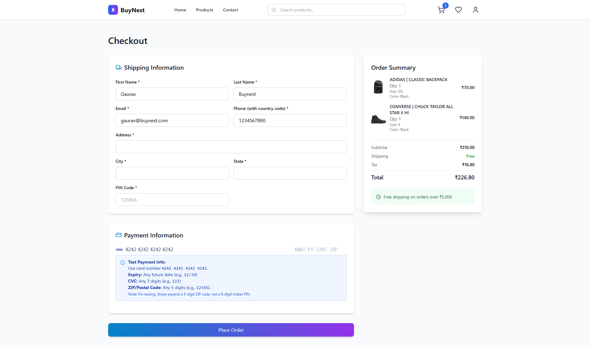
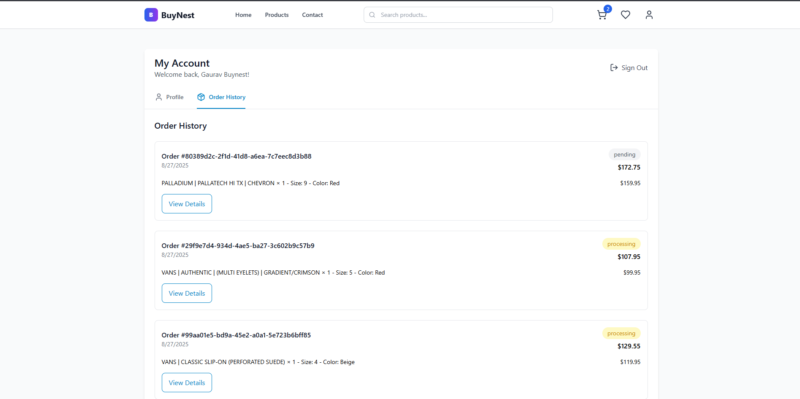
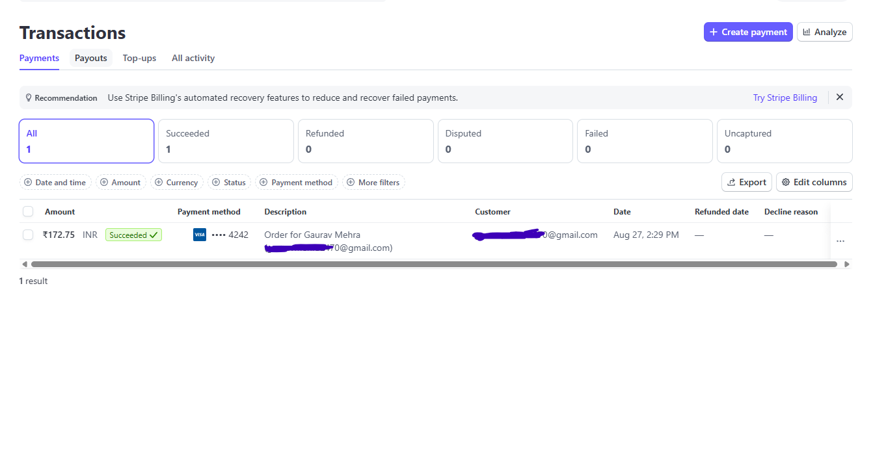

# BuyNest: Full-Stack E-commerce Application

Welcome to **BuyNest**, a modern full-stack e-commerce platform built with React on the frontend and Express.js on the backend. This project demonstrates robust cart management, dynamic order summaries, seamless email notifications, and well-structured Express APIs.

---

## 🚀 Tech Stack

### Frontend

- **React** with functional components & hooks
- **Tailwind-CSS** for sleek, responsive UI components
- **React Router** for client-side routing
- State management with React Context API
- Axios for API calls
- React Hot Toast for notifications

### Backend

- **Node.js** with **Express.js** for APIs
- MongoDB for data persistence
- Sendgrid for email notifications
- Stripe for test payments
- Environment-based configuration with `.env` files

---

## 🛒 Cart Handling

- Cart state managed via React Context API for global accessibility
- Persistent cart across pages with add, update, and remove product features
- Dynamic updates on quantity, color, and size selections
- Real-time total amount and summary recalculations
- Toast notifications for cart updates

## 💖 Favorites System

- Users can add/remove products to favorites
- Favorites persist across sessions
- Quick access to favorite items from profile
- Toast notifications for favorite updates

---

## 📋 Dynamic Order Summary

- Displays detailed product info: name, selected size & color, quantity, and price
- Calculates subtotal, estimated taxes (e.g., 15%), and total amount dynamically
- Responsive UI using Material-UI components for clarity and elegance
- Integration with Stripe for secure test payments
- Track current and previous orders

---

## 📧 Email Notifications

- Backend triggers order confirmation emails on successful checkout
- Configured using Sendgrid for reliable email delivery
- Email includes order details and customer information
- Order tracking updates sent via email

---

## ⚙️ Express APIs

- Structured routes using Express Router
- APIs for fetching products, creating orders, and checkout processing
- Controllers separate business logic from routing
- Environment variables secure sensitive data (DB credentials, email credentials)

---

## 🔐 Environment Variables

### Frontend (.env)
